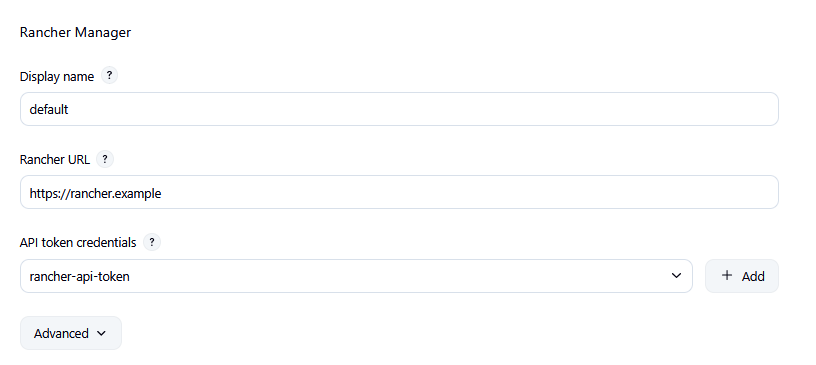
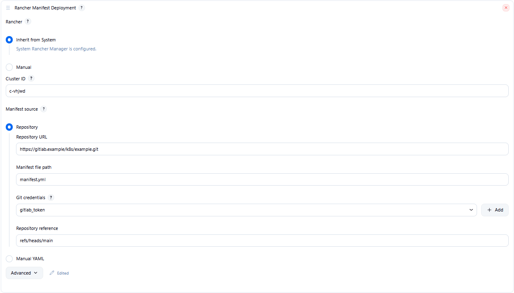
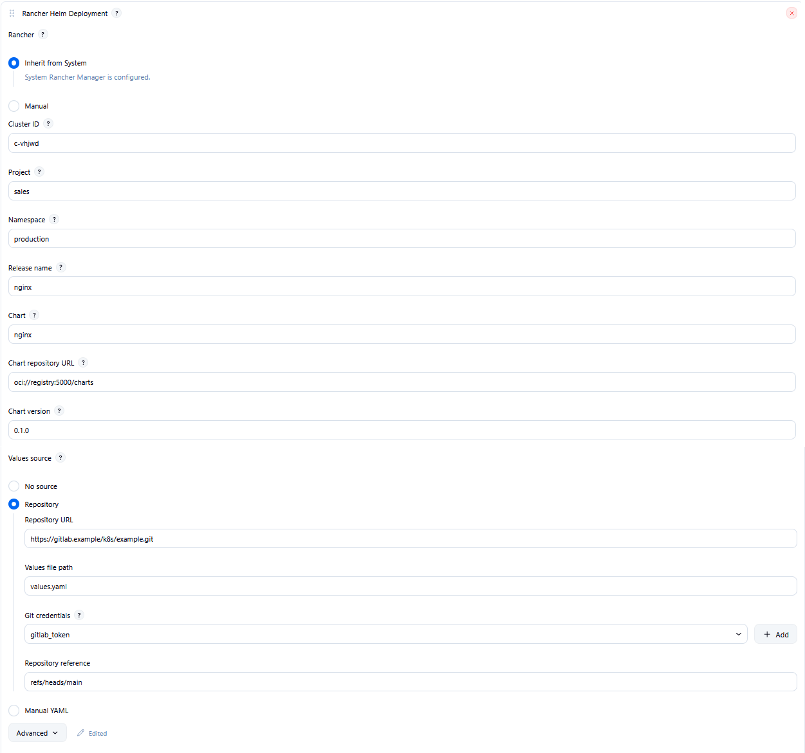

# Rancher Manager

Deploy **Kubernetes manifests** and **Helm charts** from Jenkins through the [Rancher Manager](https://www.rancher.com/) 2.x API — one Bearer token, Freestyle or Pipeline, clear build summaries.

**Who it’s for:** platform and CI engineers who already run Rancher Manager for day-2 K8s and want Jenkins jobs to apply YAML or install/upgrade Helm without driving the Rancher UI. This is **not** the legacy [Rancher](https://plugins.jenkins.io/rancher/) plugin (Cattle 1.x stacks).

Plugin id: `rancher-manager` · Artifact: `rancher-manager` · JCasC / System symbol: `rancherManager`

## What it does

Configure Rancher once under **Manage Jenkins → System**, then add build steps that talk to the Rancher API on the controller (Jenkins proxy + credentials). Each step can **Inherit** that connection or use a **Manual** URL + token for a specific job.

Typical flows:

- Apply a Kubernetes manifest from Git or pasted YAML and wait until workloads are Ready
- Install or upgrade a Helm chart from an existing ClusterRepo into a Rancher project
- Run **Validate only** to preflight the connection without mutating Rancher

Build logs stay scannable: short INFO phases and a **Summary** with `outcome=created|updated|…`. Tokens and YAML bodies are never dumped to the console.

## Features

- **System global config** — Rancher URL + Secret text API token (`rancherManager`); connectivity is checked on build **preflight** (`GET /v3/clusters/{id}`; no System Test connection button)
- **Inherit / Manual** Rancher connection on every step (default Inherit)
- **Rancher Manifest Deployment** (`rancherManifest`) — YAML from Git or manual; `POST …?action=apply`; poll Deployment/StatefulSet/DaemonSet/Job until Ready (`waitTimeoutSeconds`, default 300). ConfigMap-only succeeds after apply. Namespace comes from the YAML; the step does not create namespaces
- **Rancher Helm Deployment** (`rancherHelm`) — chart repo `http(s)://` or `oci://` resolved to an existing ClusterRepo (index refresh only if the chart is missing, then one retry). Project + namespace; optional ensure namespace **in that project**. After catalog 201, poll the Helm operation then the app. Failed Helm is never SUCCESS. Values none / YAML / Git file
- **Cluster-scoped API keys** — preflight uses cluster GET only (not `/v3/users?me=true`)
- **`validateOnly`** — field checks + preflight; no apply / catalog mutate

## Screenshots







## Quick start

1. In Rancher Manager: **Avatar → Account & API Keys** — create a key.
   Copy the **Bearer Token** (`token-…:…`), not Access Key alone.
   Leave **Scope** empty (No Scope) unless the key is only for one cluster.
2. In Jenkins: **Manage Jenkins → Credentials** → **Secret text** (e.g. ID `rancher-api-token`).
   Paste the Bearer Token value only (no `Bearer ` prefix).
3. **Manage Jenkins → System → Rancher Manager**:
   - **Display name**: e.g. `Production Rancher`
   - **Rancher URL**: `https://rancher.example`
   - **API token credentials**: select the Secret text credential
4. Add a Freestyle build step or Pipeline — see [`examples/PipelineSyntax.rancherManifest.groovy`](examples/PipelineSyntax.rancherManifest.groovy)
   and [`examples/PipelineSyntax.rancherHelm.groovy`](examples/PipelineSyntax.rancherHelm.groovy).

```groovy
pipeline {
    agent none
    stages {
        stage('Deploy') {
            steps {
                rancherManifest(
                    clusterId: 'local',
                    manifestSource: 'yaml',
                    manifestYaml: '''
apiVersion: v1
kind: ConfigMap
metadata:
  name: demo
'''
                )
            }
        }
    }
}
```

## Requirements

- Jenkins **2.541.3+**
- Rancher Manager **2.8+** (Steve catalog; not Rancher 1.x Cattle). OCI ClusterRepo needs **2.9+**
- JDK truststore must trust the Rancher TLS certificate — no skip-SSL

## Security

Report vulnerabilities through the [Jenkins security process](https://www.jenkins.io/security/) — see [`SECURITY.md`](SECURITY.md).

## License

MIT
